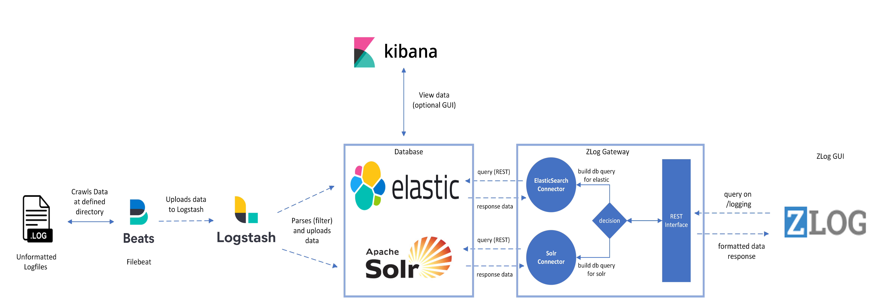

# Adesso ZLog 

ZLog is an Open Source project which uses performance optimized databases to allow searching and filtering big amounts of logdata in realtime.

The latest release is using the following stack:

* [`ElasticSearch 7.13.4`](docker.elastic.co/elasticsearch/elasticsearch:7.13.4): Database used for saving logdata.
* [`Solr 8.4.1`](docker.elastic.co/elasticsearch/solr:8.4.1): Database used for saving logdata.
* [`Logstash 7.17.13`](docker.elastic.co/logstash/logstash:7.17.13): Used to parse, filter and upload data to Elasticsearch and Solr.
* [`Filebeat 7.13.4`](docker.elastic.co/beats/filebeat:7.13.4): Used to harvest data from a directory and send it to Logstash.
* [`Kibana 7.13.4 (optional)`](docker.elastic.co/kibana/kibana:7.13.4): GUI to view and analyze data from ElasticSearch. Solr is supported too, but Kibana needs to be configured for it to work properply.




---

## Contents

1. [Requirements](#requirements)
   * [Host setup](#host-setup)
1. [Usage](#usage)
   * [Build the project](#build-the-project)
   * [Run the complete stack](#run-the-complete-stack)
1. [Configuration](#configuration)
   * [Security](#security)
   * [How to configure Elasticsearch](#how-to-configure-elasticsearch)
   * [How to configure Solr](#how-to-configure-solr)
   * [How to configure Kibana](#how-to-configure-kibana)
   * [How to configure Logstash](#how-to-configure-logstash)
   * [How to configure Filebeat](#how-to-configure-filebeat)
   * [How to configure ZLog](#how-to-configure-zlog)   
1. [Extensibility](#extensibility)
   * [How to add plugins](#how-to-add-plugins)

---

## Requirements

### Host setup

* [Docker Engine][docker-install]
* [Docker Compose][compose-install]
* 1.5 GB of RAM

> [!NOTE]
> Especially on Linux, make sure your user has the required permissions to interact with the Docker
> daemon.

By default, the stack exposes the following ports:

* 9200: Elasticsearch HTTP
* 8983 & 9983: Solr HTTP
* 5044: Logstash Beats input
* 50000: Logstash TCP input
* 9600: Logstash monitoring API
* 5601: Kibana
* 3000: ZLog Gui
* 8090: ZLog Gateway


## Usage
### Build the project
Execute the following command in the root folder to build the client and gateway:

```sh
./mvnw install
```

### Run the complete stack

With the [`docker-compose.yml`][docker-compose] file you can install the whole stack with a single command:

```sh
docker-compose up
```

If you want to change the components you can edit that here.


## Data Scheme
The ZLog Client requires that the retreived data matches a specific format with certain fields. Else the client won't show any logdata.
		  
The following fields and values are needed for the GUI to initially work:
* `time` in format `YYYY-MM-DDTHH:MM:SS.000Z` Example Value: `2016-01-28T04:30:43.000Z`
* `level` The following Strings are allowed `INFO`, `DEBUG`, `WARN`, `ERROR`
* `message` Example Value: `This is the log message`
* `component` Example Value: `ComponentTest`
* `application` Example Value: `ApplicationName`

Other addional fields can be defined and will be shown in an detailed view when you click the logentry in the GUI.

Examples:
* `logger` Example Value: `Log4J`
* `hostName` Example Value: `addesso.server`
* `threadName` Example Value: `main`
* `XXX` Example Value: `XXX`


There are two possibilites to make this work:
* The uploaded logfiles are already formatted and have all the required fields.
* The uploaded logfiles are not formatted. In this case you need to create a filter with logstash for every logfile format that is supposed to get used. 
Logstash then parses the file according to the filter and saves it into Elastic / Solr.


#### 


## Configuration

> [!IMPORTANT]
> Configuration is not dynamically reloaded, you will need to restart individual components after any configuration
> change.

### How to configure Elasticsearch

Please refer to the following documentation page for more details about how to configure Elasticsearch inside Docker
containers: [Install Elasticsearch with Docker][es-docker].

### How to configure Solr

Please refer to the following documentation page for more details about how to configure Solr inside Docker
containers: [Install Solr with Docker][solr-docker].

### How to configure Kibana

Please refer to the following documentation page for more details about how to configure Kibana inside Docker
containers: [Install Kibana with Docker][kbn-docker].


### How to configure Logstash

The Logstash configuration is stored in [`logstash/config/logstash.yml`][config-ls].

The Logstash pipelines and filters are stored in [`logstash/pipeline/`][pileline-ls].

Please refer to the following documentation page for more details about how to configure Logstash inside Docker
containers: [Configuring Logstash for Docker][ls-docker].

### How to configure Filebeat
The Filebeat default configuration is stored in [`filebeat/config/kibana.yml`][config-fb].

Please refer to the following documentation page for more details about how to configure Filebeat inside Docker
containers: [Configuring Filebeat for Docker][fb-docker].

### How to configure ZLog
#### Client
* In the [`Constants_env.js`][client-conf] the build configs are stored (local, developement, production). When building the project you need to make sure the correct config is used.

#### Gateway
* In the [`application.properties`][gateway-conf] file you can configure general parameters (For example if Elastic or Solr should be used)
* In the [`application-elastic.properties`][gateway-elastic-conf] file the configuration for the elastic connection is stored.
* In the [`application-solr.properties`][gateway-solr-conf] file the configuration for the solr connection is stored.


#### Security
ZLog supports two security modes. Security on (OAuth2) and security off.
You need to make sure that you configure both the gui and gateway to the same security mode while building the project. 
Else the gui won't be able to connect to the gateway!

* The config for the gui is located in [`package.json`][package-json] and [`Constants_env.js`][client-conf].
* The config for the gateway is located in [`application.properties`][gateway-conf]. Here you can set `security.enabled` to `true` or `false` 
* When security is enabled you need to make sure the required paramters for the OAuth2 provider are correct. 
These are stored in [`application.yml`][gateway-conf-oauth]


## File import with Logstash and Filebeat
There are different tools that allow you to import your logfiles into elasticsearch and solr.
One of the most popular tools is logstash in combination with filebeat.


### Filebeat 
Filebeat simply looks for logs in a specific path (input) and writes all the found data to an defined output (in our case logstash).
Per default all files located in `/var/log/*.log` will get automatically sent to Logstash for parsing. But you can change the default behaviour to something that suits your needs. 

### Logstash 
Logstash is a powerful tool which gives the ability to parse and customize logs before importing them to ElasticSearch and Solr.
For this to work, logstash needs to know how the incoming logfile looks and how to parse it.
We need to write a filter for every different logfile we want to import into elastic or solr.
An example filter is located in [`logstash/pipeline/logstash.conf`][filter-ls]. 
It parses and filters the Windows_2k log located in [`FileConfiguration/Windows_2k.log`][windows-file].

So if you want to parse your own logfile, you need to write an filter for it and put it in the [`logstash/pipeline'] directory and make sure it gets correctly chosen by logstash.

For more information check out:

https://www.elastic.co/guide/en/logstash/current/index.html

https://www.elastic.co/guide/en/logstash/current/pipeline-to-pipeline.html

https://www.elastic.co/guide/en/logstash/current/filter-plugins.html

## Extensibility

### How to add plugins

To add plugins to any  component you have to:

1. Add a `RUN` statement to the corresponding `Dockerfile` (eg. `RUN logstash-plugin install logstash-filter-json`)
1. Add the associated plugin code configuration to the service configuration (eg. Logstash input/output)
1. Rebuild the images using the `docker-compose build` command


## Future and TODOs

* Fix the Dataimport from Logstash into Solr.
* Secure the connection between gateway and elastic/solr (for example with username/password)
* Upgrade the Stack to the newest version including the Connectors and Libraries
* Refactor / Redo the ZLog Client (Deprecated Libraries and Security Issues)


[docker-install]: https://docs.docker.com/get-docker/
[compose-install]: https://docs.docker.com/compose/install/
[compose-v2]: https://docs.docker.com/compose/compose-v2/

[docker-compose]: ./docker-compose.yml

[config-ls]: ./FileConfiguration/logstash/config/logstash.yml
[pileline-ls]: ./FileConfiguration/logstash/pipeline
[config-fb]: ./FileConfiguration/filebeat/config/filebeat.yml

[windows-file]: ./FileConfiguration/Windows_2k.log
[filter-ls]: ./FileConfiguration/logstash/pipeline/logstash.conf

[es-docker]: https://www.elastic.co/guide/en/elasticsearch/reference/current/docker.html
[kbn-docker]: https://www.elastic.co/guide/en/kibana/current/docker.html
[ls-docker]: https://www.elastic.co/guide/en/logstash/current/docker-config.html
[fb-docker]: https://www.elastic.co/guide/en/beats/filebeat/current/running-on-docker.html
[solr-docker]: https://solr.apache.org/guide/solr/latest/deployment-guide/solr-in-docker.html

[gateway-conf]: ./gateway/src/main/resources/application.properties
[gateway-elastic-conf]: ./gateway/src/main/resources/application-elastic.properties
[gateway-solr-conf]: ./gateway/src/main/resources/application-solr.properties
[client-conf]: ./client/src/utils/Constants_env.js
[package-json]: ./client/package.json
[gateway-conf-oauth]: ./gateway/src/main/resources/application.yml